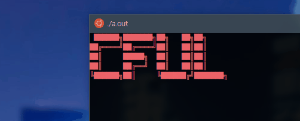
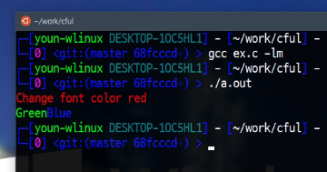
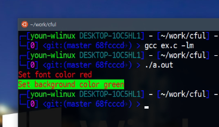
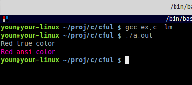

# CFUL


C언어를 사용하여 화려한 색깔을 콘솔에 출력합니다.



## 언어
  - [한국어](/README.ko.md)
  - [English](/README.md)


## CFUL이 뭔가요?
CFUL 은 다채로운 색깔을 출력할 수 있도록 해주는 함수들입니다.
이것은 RGB 시스템을 지원합니다.

## 지원
  - Linux
  - Windows 10
  - MacOS

만약 당신의 OS 가 트루컬러를 지원하지 않는다면, ansi 컬러를 사용할 수 있습니다.


## 어떻게 사용하나요?
당신이 이 함수들을 사용하고 싶으면 `cful.h` 를 프로젝트에 포함시켜주기만 하면 됩니다.

```c
#include "cful.h"
```

<br><br>

전경색 문자열 가져오기
```c
FG_COLOR(r, g, b);
_F(r, g, b);
```

예제
```c
#include <stdio.h>
#include "cful.h"

int main ( void )
{
    printf(FG_COLOR(255, 0, 0)"Change font color red" RESET "\n");
    printf(_F(0, 255, 0) "Green" _F(0, 0, 255) "Blue" RESET "\n");
    return 0;
}
```


<br><br>


배경색 문자열 가져오기

```c
BG_COLOR(r, g, b);
_B(r, g, b);
```

예제
```c
#include <stdio.h>
#include "cful.h"

int main ( void )
{
    printf(_F(255, 255, 255) BG_COLOR(255, 0, 0)"Change back color red" RESET "\n");
    printf(_F(255, 255, 255) _B(0, 255, 0) "Green" _B(0, 0, 255) "Blue" RESET "\n");
    return 0;
}
```


<br><br>

색상 지정

```c
SET_COLOR(type, r, g, b);
SET_FG_COLOR(r, g, b);
SET_BG_COLOR(r, g, b);
```

type 매개변수는 `FOREGROUND` 또는 `BACKGROUND` 상수를 사용합니다.

```c
#define FOREGROUND  "38"
#define BACKGROUND  "48"
```


예제
```c
#include <stdio.h>
#include "cful.h"

int main ( void )
{
    SET_COLOR(FOREGROUND, 255, 0, 0);
    printf("Set font color red");

    SET_BG_COLOR(0, 255, 0);
    printf("Set background color green");
    printf(RESET "\n");
    return 0;
}
```


<br><br>

ansi color 사용

만약 당신의 OS가 트루컬러를 지원하지 않는다면, `SET_ANSI_MODE(1)` 함수를 사용하세요. 그리고 당신은 `SET_COLOR`, `SET_FG_COLOR`, `SET_BG_COLOR` 함수만 사용해야 합니다.

```c
SET_ANSI_COLOR(mode); // 1: enable, 0: disable
```


예제
```c
#include <stdio.h>
#include "cful.h"

int main ( void )
{
    printf(_F(255, 0, 0) "Red true color" RESET "\n");

    SET_ANSI_MODE(1);
    SET_FG_COLOR(255, 0, 0); 
    printf("Red ansi color" RESET "\n");
    return 0;
}

```



## 컴파일

만약 당신의 프로젝트를 gcc로 컴파일 할때면, `math.h` 헤더를 위한 라이브러리 옵션을 명령줄에 추가하세요
```sh
gcc -o cful main.c -lm
```


<br><br><br>
감사합니다.